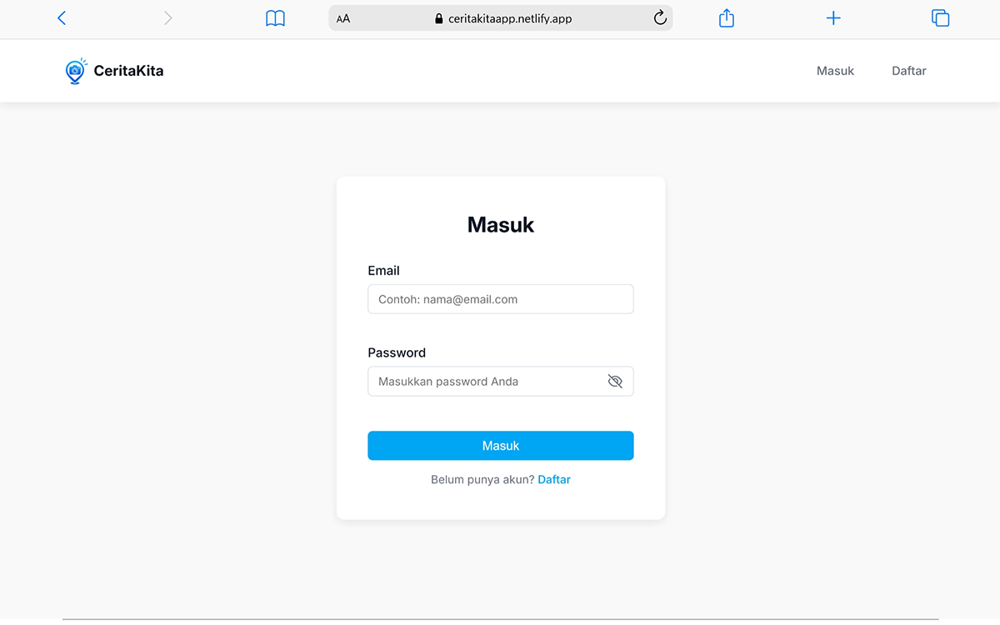
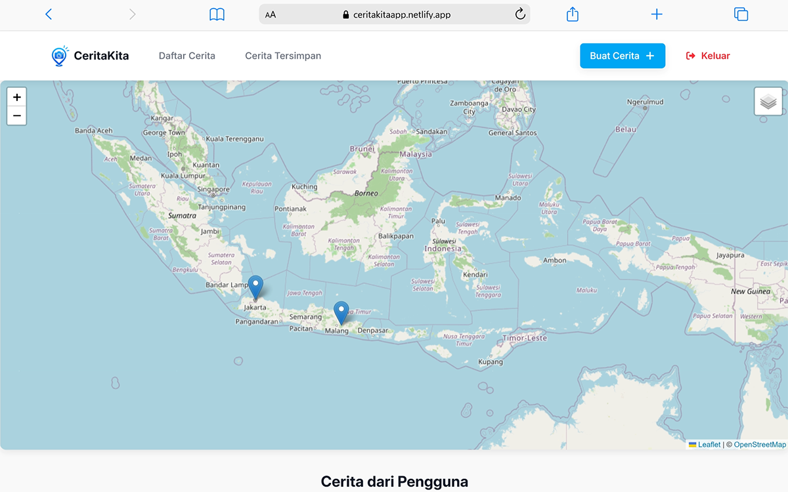
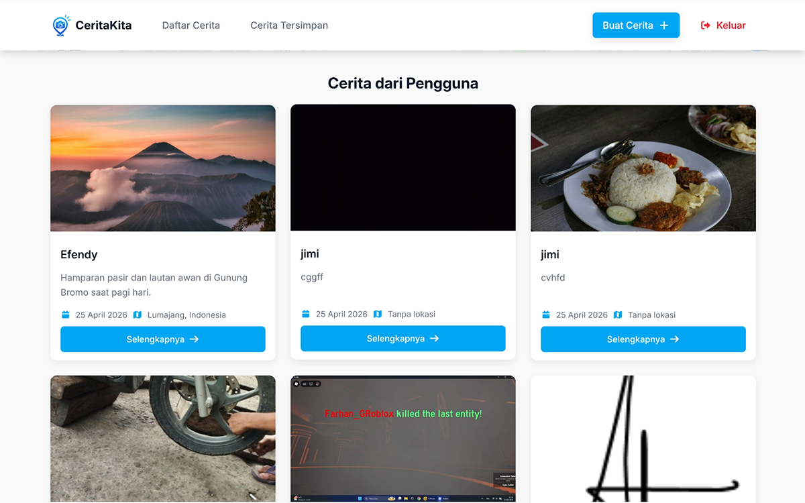
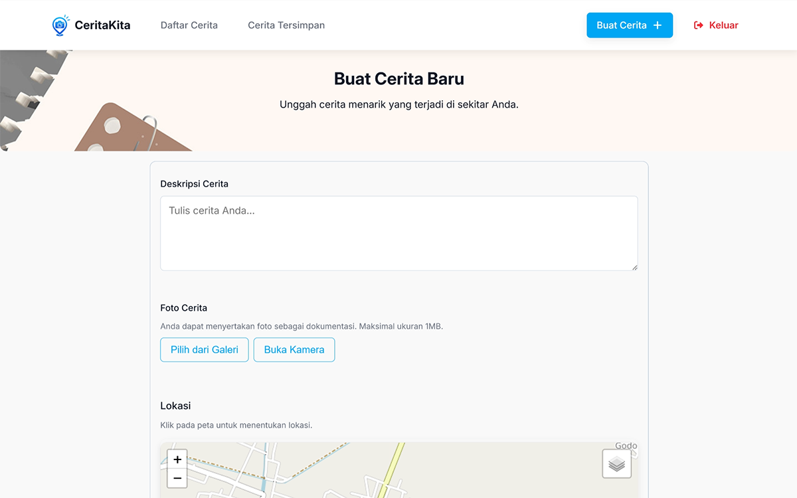
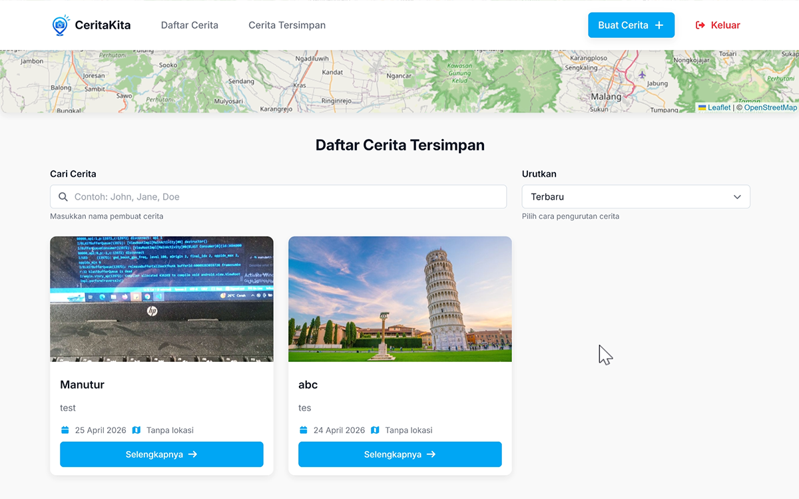
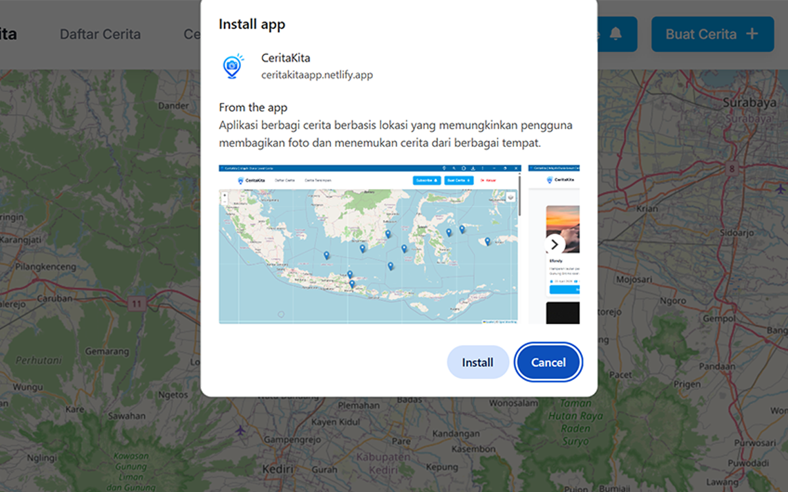

# CeritaKita App

A modern web app for sharing stories with interactive maps and PWA support.

[](https://ceritakitaapp.netlify.app) [](https://ceritakitaapp.netlify.app)

  

## Table of Contents

- [Description](#description)
- [Live Demo](#-live-demo)
- [Screenshots](#-screenshots)
- [Key Features](#-key-features)
- [Project Achievements](#-project-achievements)
- [Tech Stack](#️-tech-stack)
- [Setup & Development](#️-setup--development)
- [Project Structure](#-project-structure)
- [Author](#-author)

---

## Description

CeritaKita is a location-based story sharing web application built using a **Single Page Application (SPA)** architecture. It integrates interactive maps, **Push Notifications**, **Progressive Web App (PWA)** capabilities, and **IndexedDB** for local data storage.

Users can explore stories based on location, create new stories with images and geolocation, bookmark their favorite stories, and continue using the app even in offline conditions.

This project was developed as part of the submission for the **[Belajar Pengembangan Web Intermediate](https://www.dicoding.com/academies/219)** course on Dicoding, focusing on modern web technologies and optimal user experience.

---

## 🌐 Live Demo

👉 https://ceritakitaapp.netlify.app

---

## 📸 Screenshots

<table>
  <tr>
    <td align="center">
      <b>Login</b><br>
      
    </td>
    <td align="center">
      <b>Home - Map</b><br>
      
    </td>
  </tr>
  <tr>
    <td align="center">
      <b>Home - Story List</b><br>
      
    </td>
    <td align="center">
      <b>Add Story</b><br>
      
    </td>
  </tr>
  <tr>
    <td align="center">
      <b>Bookmark</b><br>
      
    </td>
    <td align="center">
      <b>PWA Install</b><br>
      
    </td>
  </tr>
</table>

---

## ✨ Key Features

- 📍 Interactive Map (Leaflet.js)
- ➕ Add New Story
- ⚡ Single Page Application (SPA)
- 🔔 Push Notifications
- 📲 Progressive Web App (PWA)
- 🌐 Offline Support (Workbox)
- 💾 IndexedDB Integration
- ⭐ Bookmark Feature
- ♿ Accessibility (WCAG)

---

## 🎯 Project Achievements

This project has met all criteria of the two submission stages:

### First Submission

- [x] Implemented SPA with page transitions
- [x] Displayed data visualization on maps
- [x] Implemented add new data feature
- [x] Applied accessibility standards

### Second Submission

- [x] Maintained all previous features
- [x] Implemented push notification
- [x] Added PWA support (installable & offline mode)
- [x] Integrated IndexedDB
- [x] Deployed application publicly

---

## 🛠️ Tech Stack

- HTML, CSS, JavaScript (ES6+)
- Webpack & Babel
- SPA (Hash Router)
- MVP Architecture
- Leaflet.js
- [Dicoding Story API](https://story-api.dicoding.dev/v1)
- Workbox (Service Worker)
- IndexedDB
- Web Push API

---

## ⚙️ Setup & Development

### Prerequisites

- Node.js (v12+)
- npm

### Installation

```bash id="b5h9pm"
npm install
```

### Run Project

- Development Server

```bash id="ux0d06"
npm run start-dev
```

- Build Production

```bash id="nf9oqw"
npm run build
```

- Preview Production

```bash id="3j4sru"
npm run serve
```

---

## 📁 Project Structure

```bash
ceritakita-app
├── package.json
├── package-lock.json
├── README.md
├── webpack.common.js
├── webpack.dev.js
├── webpack.prod.js
└── src/
    ├── index.html
    ├── public/
    │   ├── app.webmanifest
    │   ├── favicon.png
    │   └── images/
    │       ├── logo.png
    │       ├── notes-background.jpg
    │       ├── placeholder-image.jpg
    │       ├── errors/
    │       ├── icons/
    │       └── screenshots/
    ├── scripts/
    │   ├── data/
    │   ├── pages/
    │   ├── routes/
    │   ├── utils/
    │   ├── config.js
    │   ├── index.js
    │   ├── sw.js
    │   └── templates.js
    └── styles/
        ├── responsive.css
        └── styles.css
```

---

## 👤 Author

Muhammad Aris Efendi

---

## ⭐ Support

If you like this project, consider giving it a ⭐ on GitHub!
